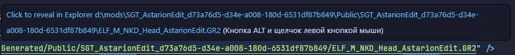
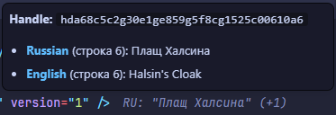
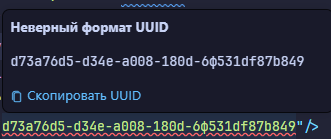
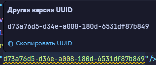
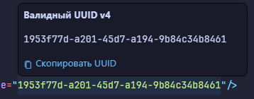
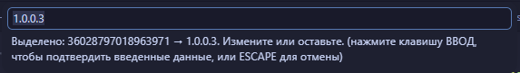
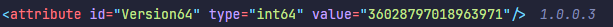
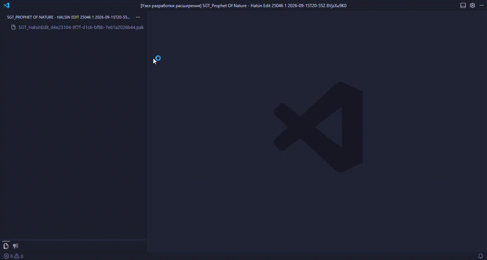

# 🛠️ LSLib VS Code Tools

**Набор инструментов для моддинга Baldur's Gate 3 и Divinity: Original Sin 2 прямо в VS Code**

---

## 📖 О расширении

**LSLib VS Code Tools** — это расширение для Visual Studio Code, которое интегрирует инструменты из [LSLib](https://github.com/Norbyte/LSLib) прямо в ваш редактор. Больше не нужно переключаться между окнами и консолью — распаковывайте моды, конвертируйте ресурсы и редактируйте файлы прямо в привычной среде разработки.

---

### 📦 Работа с PAK архивами

- **Распаковка PAK** Извлечение `.pak` архива в папку с тем же именем
- **Запаковка в PAK** Создание `.pak` архива из папки одним кликом

### 📄 Работа с файлами

- **Конвертация ресурсов**:
  LSF ↔ LSX — бинарный формат ↔ XML
  LSF ↔ LSJ — бинарный формат ↔ JSON
  LSB ↔ LSX/LSJ — скриптовые бинарные форматы

- `v1.5.0` **Поддержка ссылок на файлы** : найденные файлы будут ссылкой при нажатии на которую вы сразу перейдете к файлу

### 🌍 Локализация

- **LOCA ↔ XML** — конвертация файлов переводов в читабельный формат
- `v1.5.0` **Декоратор переводов** - рядом со строкой перевода будет показан декоратор при наведении мыши на который будет подсказка с ссылками на перевод:

### 🆔 Работа с UUIDv4

- **Генерация UUID** и вставка в позицию курсора/выделенного текста
- `v1.5.0` **Валидация UUID** через декоратор и копирование в подсказке:

### 🔢 Работа с версиями

- **Кодирование версии** — ввод версии в формате `Major.Minor.Revision.Build`, конвертация в `int64`

- **Декоратор версий** - отображение декоратора версии прямо в редакторе:

### 👁 Базовая демонстрация v1.4.0

### 🙏 Благодарности

- **Norbyte** — за создание LSLib.
- **Larian Studios** — за прекрасные игры!
